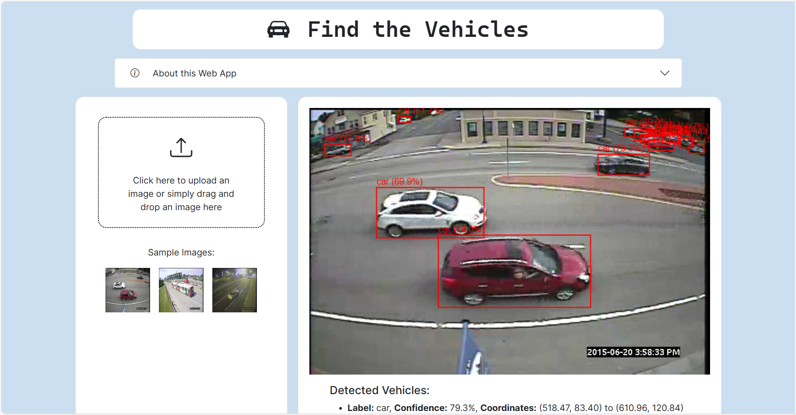

# Find The Vehicles App

This application uses YOLOv5, trained through transfer learning, for object detection and annotation. The backend is built with FastAPI and served on an AWS EC2 instance. The frontend is built with Next.js and deployed on Vercel.



## Repository Structure

- **backend/**: Contains the FastAPI backend code and Docker configuration.
- **frontend/**: Contains the Next.js frontend code.
- **model-training/**: Contains the Jupyter notebook used for model training.

## Setup

### Frontend
Navigate to the `frontend` directory and install dependencies:

```bash
cd frontend
npm install
```
Run the development server:

```bash
npm run dev
```

### Backend
Navigate to the backend directory and create a virtual environment:

```bash
cd backend
python -m venv venv
source venv/bin/activate
```

Install dependencies:

```bash
pip install -r requirements.txt
```

Run the FastAPI server:

```bash
uvicorn app.main:app --reload
```

## Deployment

### Frontend on Vercel
You can deploy using the Vercel CLI or through the Vercel dashboard.

### Backend on DockerHub
Pull the Docker image from DockerHub and run it on your preferred server instance:

```bash
docker pull gustavoribeirosantiago/find-the-vehicles-backend:latest
docker run -d -p 8000:8000 --name find-the-vehicles-backend gustavoribeirosantiago/find-the-vehicles-backend:latest
```

## Model Training
Navigate to the model-training directory to explore the Jupyter notebook used for model training.

## License
This project is licensed under the MIT License - see the LICENSE file for details.

## Contact
Gustavo Ribeiro Santiago

Email: gustavorsa@poli.ufrj.br

GitHub: https://github.com/gustavo-ribeiro-santiago

Feel free to reach out if you have any questions or feedback!